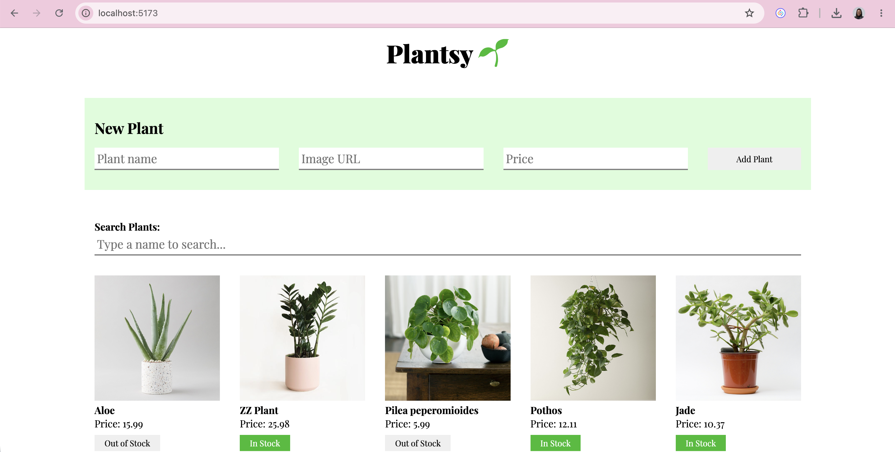

# Plantsy

A React app for browsing, adding, and managing plant inventory. Fetches and persists plants through a json-server backend, with client-side search and stock status toggling.

## Screenshot



## Demo


## Features

- Fetches and displays all plants from the backend on page load
- Adds a new plant via a form, which POSTs to the backend and updates the page
- Marks a plant as sold out or back in stock (session only, not persisted)
- Filters the plant list by name as you type in the search box

## Installation

Clone the repo and install dependencies:

git clone git@github.com:Macrinejangu/react-hooks-plantshop-cr-vite.git
cd react-hooks-plantshop-cr-vite
npm install


## Usage

Start the backend (runs on port 6001):

npm run server


In a separate terminal, start the frontend:

npm run dev


Open the printed local URL in your browser. You can also open [http://localhost:6001/plants](http://localhost:6001/plants) directly to confirm the backend is serving data.

## Testing

npm run test


## API reference

Base URL: `http://localhost:6001`

### GET /plants

Example response:

```json
[
  {
    "id": 1,
    "name": "Aloe",
    "image": "./images/aloe.jpg",
    "price": 15.99
  },
  {
    "id": 2,
    "name": "ZZ Plant",
    "image": "./images/zz-plant.jpg",
    "price": 25.98
  }
]
```

### POST /plants

Required headers:

```js
{
  "Content-Type": "application/json"
}
```

Request body:

```json
{
  "name": "string",
  "image": "string",
  "price": "number"
}
```

Example response:

```json
{
  "id": 1,
  "name": "Aloe",
  "image": "./images/aloe.jpg",
  "price": 15.99
}
```

## Tech stack

- React
- Vite
- json-server
- Vitest and React Testing Library

## Project status

Complete. All four core deliverables (render, create, mark out of stock, search) are implemented and passing tests.


